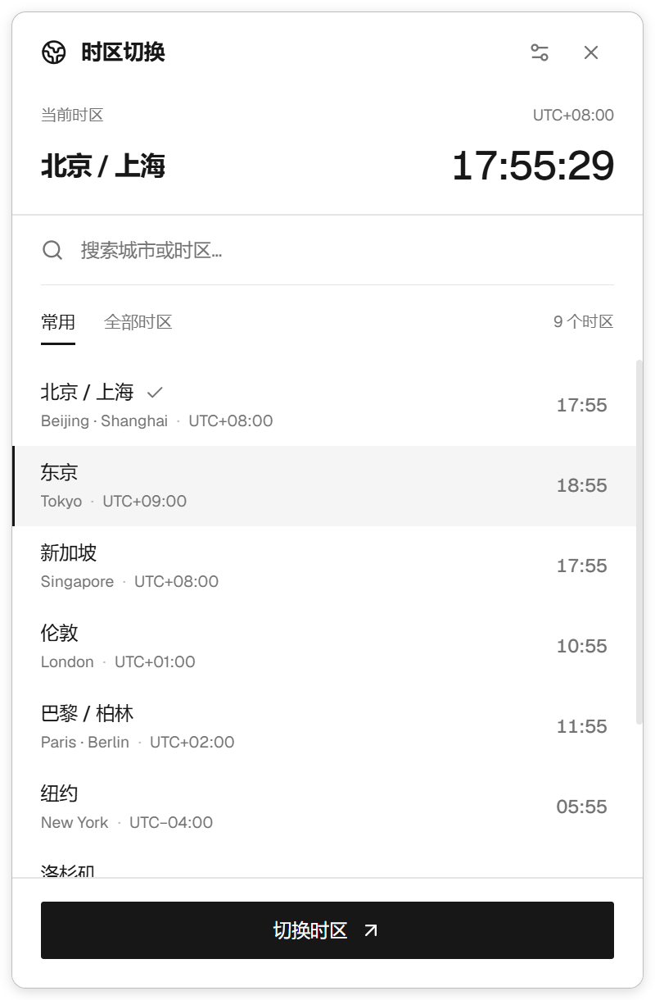

# 时区切换 · Windows Timezone Switcher

一个用于 Windows 的时区切换托盘工具。点击托盘图标即可搜索城市、预览当地时间，并修改本机系统时区。

采用黑白灰浅色界面，窗口默认靠近托盘所在屏幕的右下角，在任务栏上方保留间距。



## 下载与使用

在 [Releases](https://github.com/qCanoe/windows-timezone-switcher/releases/latest) 中下载 `TimezoneTray-Windows-x64.zip`，解压后运行 `Timezone Tray.exe`。请保留整个解压目录，无需安装 Node.js。

1. 左键点击托盘图标打开面板；图标也可能位于 Windows 的“隐藏图标”区域。
2. 选择常用城市，或搜索全部 Windows 时区，再点击“切换时区”。
3. 切换成功后自动收起。点击面板外部、按 Esc 或点击右上角 × 也可收起。
4. 右键托盘图标可直接切换常用时区，或选择“退出”。

重复启动会打开已有面板。程序运行时无需联网，目前不自动开机启动。

## 功能

- 搜索城市、中英文时区名称和 UTC 偏移。
- 常用时区包括北京 / 上海、东京、新加坡、伦敦、巴黎 / 柏林、纽约、洛杉矶、悉尼与 UTC。
- 显示当前系统时区及各地时间，使用 Windows 提供的夏令时规则。
- 支持多屏与显示缩放，面板不覆盖任务栏。
- 固定浅色界面、圆角边框与简约图标。
- 每次打开都等待画面绘制完成再显示，避免透明窗口重现时的闪烁。

修改失败时，界面提供“以管理员权限重试”。如果 Windows 自动将时区改回，请通过右上角“系统设置”检查“自动设置时区”。单位设备的管理策略也可能限制时区修改。

## 本地开发

开发和打包环境为 Windows x64，建议使用 Node.js 22 或更新的兼容版本。

```powershell
git clone https://github.com/qCanoe/windows-timezone-switcher.git
cd windows-timezone-switcher
npm ci
npm run build
npm start
```

界面使用 React、TypeScript、Vite、Tailwind CSS 与 shadcn/ui；桌面和托盘使用 Electron。时区列表通过 Windows PowerShell 读取，系统时区通过 `tzutil.exe` 修改。

## 构建

生成便携目录版：

```powershell
npm run package:dir
```

输出位于 `release/win-unpacked/`。运行时必须保留整个目录。

生成单文件便携版：

```powershell
npm run package
```

输出位于 `release/TimezoneTray.exe`。首次打包需要联网下载 Electron 和 Windows 打包组件。当前上传的 Release 使用已验证的便携目录版。

## 验证

```powershell
npm test
npm run build
npm run test:ui
```

时区测试验证已安装时区、非法输入与当前时区不变的操作。界面检查覆盖搜索、选择、托盘、收起、连续打开与任务栏上方定位，截图输出至 `artifacts/`。

也可检查打包后的程序：

```powershell
node check-ui.cjs "release/win-unpacked/Timezone Tray.exe"
```

自动检查不会主动切换到其他时区；实际跨时区切换和管理员权限流程需要人工验证。

## 项目结构

```text
electron/        托盘窗口、进程通信与 Windows 时区服务
src/             React 界面与 shadcn/ui 组件
assets/          图标原图
docs/            界面截图
check-ui.cjs     Electron 界面检查
```

Electron 渲染进程启用上下文隔离与沙箱，关闭 Node.js 集成。切换请求只接受本机已安装的时区，并在执行后重新读取系统状态确认结果。
